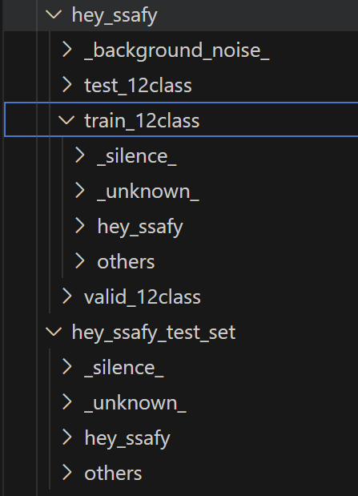

# Broadcasted Residual Learning for Efficient Keyword Spotting.
본 프로젝트는 다음 논문을 참고하여 On-Device에서 작동할 수 있는 코드로 변환했습니다. 자세한 내용이 궁금하시면 다음 깃허브와 논문을 참고하시면 됩니다.<br>

[BCResnet Github링크](https://github.com/Qualcomm-AI-research/bcresnet)

**Byeonggeun Kim<sup>\*1</sup>, Simyung Chang<sup>\*1</sup>, Jinkyu Lee<sup>1</sup>, Dooyong Sung<sup>1</sup>, "Broadcasted Residual Learning for Efficient Keyword Spotting", Interspeech 2021.** [[ArXiv]](https://arxiv.org/abs/2106.04140)

*Equal contribution
<sup>1</sup> Qualcomm AI Research (Qualcomm AI Research is an initiative of Qualcomm Technologies, Inc.)

It contains the keyword spotting standard benchmark, [Google speech command datasets v1 and v2](https://arxiv.org/abs/1804.03209).

## Getting Started
본 글에서는 BCResNet을 End-To-End 방식으로 안드로이드 스튜디오에 삽입할 수 있도록 이해를 돕기 위해 작성했다. 이를 위해 BCRenset의 모델 구조를 살펴보고 이를 Torch Script로 변환하는 방법을 다루고자 한다.

### Prerequisites
This code requires the following:
* python = 3.6
* pytorch = 1.7.1
* torchaudio = 0.7.2
* torchvision = 0.8.2
### Installation
```text
conda create -n bcresnet python=3.6
conda activate bcresnet
conda install pytorch==1.7.1 torchvision==0.8.2 torchaudio==0.7.2 -c pytorch
conda install tqdm, requests
```

## 모델 설명
해당 논문에서는 주파축을 압축하고 Residual Learning 기법과 Broadcasted 방법론을 활용해 파라미터를 줄이는 방법을 사용했다.

<details>

<summary>BCResBlock 핵심 코드</summary>

```python
class BCResBlock(nn.Module):
    def __init__(self, in_plane, out_plane, idx, stride):
        super().__init__()
        self.transition_block = in_plane != out_plane # 채널 개수가 다르면 레이어를 둬서 채널 개수를 out_plane 개수와 맞춰서 groups를 사용할 수 있도록 한다.
        kernel_size = (3, 3)          

        # 2D part (f2)
        layers = []                         
        if self.transition_block:
            layers.append(ConvBNReLU(in_plane, out_plane, idx, 1, 1))
            in_plane = out_plane
        layers.append(
            ConvBNReLU(
                in_plane,
                out_plane,
                idx,
                (kernel_size[0], 1), 
                (stride[0], 1),
                groups=1,
                ssn=True,
                activation=False,
            )
        ) 
        self.f2 = nn.Sequential(*layers)                      # Sequential을 활용해 고정적인 레이어를 사용한다. 이는 변환 방법에 크게 영향을 미침으로 중요하게 본다.
        self.avg_gpool = nn.AdaptiveAvgPool2d((1, None))      # 주파수 축을 압축시켜서 학습 파라미터를 줄이도록 한다.

        # 1D part (f1)
        self.f1 = nn.Sequential(                              # 시간 축으로 kernel_size[1] = 3 만큼 계속 이동하면서 연산을 진행한다.
            ConvBNReLU(
                out_plane,
                out_plane,
                idx,
                (1, kernel_size[1]),
                (1, stride[1]),
                groups=out_plane,                             # 그룹 수를 out_plane과 같게 함으로써 학습 파라미터를 줄인다.
                swish=True,                     
                use_dilation=True,
            ),
            nn.Conv2d(out_plane, out_plane, 1, bias=False),
            nn.Dropout2d(0.1),
        )

    def forward(self, x):
        # 2D part
        shortcut = x
        x = self.f2(x)
        aux_2d_res = x
        x = self.avg_gpool(x)

        # 1D part
        x = self.f1(x)
        x = x + aux_2d_res                                    # residual leanring을 활용해 기울기 소실 문제를 해결하도록 한다.
        if not self.transition_block:
            x = x + shortcut                                  # broadcasted 연산을 활용해 학습 파라미터의 개수를 최소화하며 정보를 다시 복원한다.
        x = F.relu(x, True)
        return x
```
</details>

## Usage

### 커스텀 데이터 만드는 방법
* data 폴더에 데이터를 저장할 폴더를 만든다.
  * 계층은 background_noise(Preprocess에서 노이즈를 삽입한다), train, valid, test를 생성한다.
  * 각 폴더에 분류가능하도록 데이터를 둔다.
* data 폴더와 별개로 테스트 데이터를 저장할 폴더를 생성한다.
* 두 단계를 완성하면 밑과 같은 폴더 구조를 갖는다.
* 이 때 팁은 현재 ver=1 혹은 2일 때(구글 자료들)만 처리하도록 했기 때문에 이를 수정해야 한다. 따라서 custom ver를 코드에 작성해두는 게 좋다.
<details>
<summary>버전 수정한 코드</summary>

  ```python
  def _load_data(self):
        
        if self.ver == 2:
            base_dir = base_dir.replace("v0.01", "v0.02")
            url = url.replace("v0.01", "v0.02")
            url_test = url_test.replace("v0.01", "v0.02")

        ## 밑에 추가

        elif self.ver == 3:                                           # 해당 부분만 추가하면 된다.                             
            base_dir = './data/hey_ssafy'
        elif self.ver == 4:
            base_dir = './data/hey_ssafy2'
        
        if self.ver ==3:
            test_dir = base_dir+"_test_set"                           # 테스트 셋 만드는 부분을 추가하면 된다.
        elif self.ver==4:
            test_dir = base_dir[:-1]+"_test_set"

  ```
</details>
<details>
<summary>샘플 폴더 계층 구조</summary>
<div style="width: 200px;">
  
</div>
</details>

### 정답 레이블 수정
```python
class BCResNets(nn.Module):
    #def __init__(self, base_c, num_classes=14): bcresnet.py
    def __init__(self, base_c, num_classes=4): # 정답 레이블 개수 수정
```
```python
# util.py 레이블 수정
# label_dict = {
#     "_silence_": 0,
#     "_unknown_": 1,
#     "down": 2,
#     "go": 3,
#     "left": 4,
#     "no": 5,
#     "off": 6,
#     "on": 7,
#     "right": 8,
#     "stop": 9,
#     "up": 10,
#     "yes": 11,
#     "hey_ssafy":12, # 추가
#     "others": 13
# }
label_dict={
    "_silence_": 0,
    "_unknown_": 1,
    "hey_ssafy":2, # 추가
    "others": 3
}
```

## End-to-End 모델로 변환하기
* 모델의 흐름은 wav -> 스펙트로그램 변환 -> bcresnet -> 결과
* 따라서 스펙트로그램과 bcresnet에 대한 모델을 torch script 파일로 변환해야한다.

### LogMel nn.Module로 상속하기
* 오디오 데이터에 대해서 스펙트로그램을 활용해 목소리의 주파수 특징을 뽑아내는데, 이 때 시간 흐름에 따른 특징을 추출하기 위해서 MelSpectrogram을 활용해 나타낸다. 
* torch script로 변환하기 위해서는 nn.Module을 상속받아야 한다. 하지만 LogMel class는 nn.Module 클레스를 상속받지 않았고, 이 과정을 거쳐야 BCresnet으로 통과될 수 있으므로 해당 클레스를 nn.Module을 상속하도록 한다. 그리고 모델 학습이 끝나면 최종 단계에서 ptl 모델로 변환하는 과정을 거친다. 그래서 nn.Module을 상속한다.
```python
class LogMel(nn.Module):
```

### torch script로 변환하기
* torch script로 변환하는 단계는 총 5단계 이다.
  * 모델 준비 -> 입력 테스트 -> 모델 변환 -> 중간 저장 단계 -> 최종 최적화
* 모델 준비
  * 모바일 환경에서 실행 가능한 상태로 준비
    * 모델을 평가모드로 전환, GPU -> CPU로 이동
```python
  self.model.eval()
  self.model.to('cpu')
```
* 입력 테스트
  * 모델의 정상 작동 여부 확인하기 위함
    * 테스트용 더미 데이터를 생성한다.
```python
  input_sample = torch.randn(1,1,40, 201) # BCResnet의 입력인 shape(1,1,40,201)을 맞춰야 한다. 
```
* 모델 변환
  * 모델 구조 최적화
    * 모델 구조를 단순화 하기 위함
```python
trace_model = torch.jit.trace(self.model, input_sample, options)
```
* 중간 저장 단계
  * 변환된 모델 백업
    * TorchScript 형식으로 모델 저장
```python
traced_model.to('cpu')  # CPU로 변환된 모델 저장
traced_model.save('model_scripted.pt') # 일반 torchscript 모델 저장
```
* 최종 최적화
  * 모바일 환경 최적화
    * 최적화된 모델 저장할
```python
optimized_model = optimize_for_mobile(traced_model)
optimized_model._save_for_lite_interpreter("model_optimized.ptl") # 모바일 최적화 모델 저장
```

<details>

<summary>총 전체 코드</summary>

```python
def save_for_mobile(self):
            """
            Save the model in a format optimized for mobile.
            """
            # 학습 완료 후 모델을 CPU로 이동
            self.model.eval()
            self.model.to('cpu')

            # CPU에서의 입력 샘플 생성
            input_sample = torch.randn(1,1, 40, 201) # > 1,1, 40, 101에서 수정

            # TorchScript로 변환
            traced_model = torch.jit.trace(self.model, input_sample, strict=True, check_trace=True)

            with torch.no_grad():
                output= traced_model(input_sample)
                print(f"Input shape: {input_sample.shape}")
                print(f"Output shape: {output.shape}")

            traced_model.to('cpu')  # CPU로 변환된 모델 저장
            traced_model.save("model_scripted.pt")  # 일반 TorchScript 모델 저장


            # 모바일 최적화 적용
            optimized_model = optimize_for_mobile(traced_model)
            optimized_model._save_for_lite_interpreter("model_optimized.ptl")  # 모바일 최적화 모델 저장

            print("\nOptimized model saved as model_optimized.ptl")
```
</details>

### 모델 변환 단계 비교
| | torch.jit.trace | torch.jit.script |
|------|----------------|-----------------|
| 특징 | • 고정된 모델 구조만 처리 가능<br>• 실제 입력값으로 모델을 실행하면서 연산 그래프를 기록<br>• Sequential과 같이 고정된 forward pass에 적합 | • 동적인 모델 구조 처리 가능<br>• Python 코드를 직접 TorchScript로 변환<br>• 조건문/반복문이 있는 복잡한 모델에 적합 |
| 컴파일 방법 | • model.eval()<br>• example_input = torch.randn(1, 3, 224, 224)<br>• traced_model = torch.jit.trace(model, example_input) | • model.eval()<br>• scripted_model = torch.jit.script(model) |
| 적용 가능한 구조 | • nn.Sequential로 구성된 고정 레이어<br>• Forward pass가 항상 동일한 연산 수행<br>• ResNet, VGG와 같은 고정 구조 모델 | • if문으로 조건부 실행하는 레이어<br>• for문으로 동적으로 레이어 생성<br>• args에 따라 block 수가 변하는 구조<br>• RNN, LSTM과 같은 재귀적 구조 |
| 제약 사항 | • 조건문(if)이 있으면 안됨<br>• Python의 control flow 사용 불가<br>• List comprehension 사용 불가<br>• Dynamic layer 수 변경 불가 | • Python의 일부 기능만 지원<br>• 복잡한 Python 객체 지원 안 함<br>• 서드파티 라이브러리 직접 사용 불가 |
| 주의사항 | • 입력 데이터의 shape이 고정되어야 함<br>• 컴파일 시 제공한 입력과 다른 shape 처리 불가<br>• 모든 연산이 추적 가능해야 함 | • 동적 구조를 위해 TorchScript 문법 준수 필요<br>• 타입 어노테이션이 필요할 수 있음<br>• 디버깅이 더 어려울 수 있음 |
| 최적화 | • 실행 경로가 고정되어 있어 더 강력한 최적화 가능<br>• 연산 그래프 최적화가 용이 | • 동적 구조로 인해 제한적 최적화<br>• 런타임에 결정되는 부분이 있어 최적화 어려움 |

### 추가 팁:
1. 모델 구조가 단순하고 고정적이면 `trace`를 사용하는 것이 성능상 유리하다.
2. 복잡한 로직이 있다면 `script`를 사용하되, 가능한 TorchScript가 지원하는 형태로 코드를 수정하는 것이 좋다.
3. 두 방식을 혼합해서 사용할 수도 있다:
```python
class ComplexModel(nn.Module):
    def __init__(self):
        self.static_part = torch.jit.trace(StaticNet(), example_input)
        self.dynamic_part = torch.jit.script(DynamicNet())
```

### 동적 레이어 정적 레이어로 바꾸는 방법
* unpacking 연산을 활용해 Sequential 레이어로 묶는다.

```python

# 1. 리스트를 사용한 방법
class ConvNet(nn.Module):
    def __init__(self, n_layers):
        super().__init__()
        layers = []
        # 리스트에 레이어 추가
        for i in range(n_layers):
            layers.extend([
                nn.Conv2d(64, 64, 3, padding=1),
                nn.BatchNorm2d(64),
                nn.ReLU()
            ])
        
        self.features = nn.Sequential(*layers)  # *는 list unpacking

# 2. ModuleList를 Sequential로 변환
class ConvNet(nn.Module):
    def __init__(self, n_layers):
        super().__init__()
        # 먼저 ModuleList로 생성
        self.layers = nn.ModuleList([
            nn.Conv2d(64, 64, 3, padding=1)
            for _ in range(n_layers)
        ])
        
        # Sequential로 변환
        self.features = nn.Sequential(*self.layers) 
```

## 모델 훈련 명령어
```sh
python main.py --tau 1 --gpu 0 --ver 3
```

## 기타사항
* 오디오 길이에 따라 데이터에 패딩 크기를 줄이거나 늘려야 하므로 이는 utils.py에서 해당 폴더의 소스 코드를 참고하면 수정해도 된다.

## Reference
If you find our work useful for your research, please cite the following:
```
@inproceedings{kim21l_interspeech,
  author={Byeonggeun Kim and Simyung Chang and Jinkyu Lee and Dooyong Sung},
  title={{Broadcasted Residual Learning for Efficient Keyword Spotting}},
  year=2021,
  booktitle={Proc. Interspeech 2021},
  pages={4538--4542},
  doi={10.21437/Interspeech.2021-383}
}
```